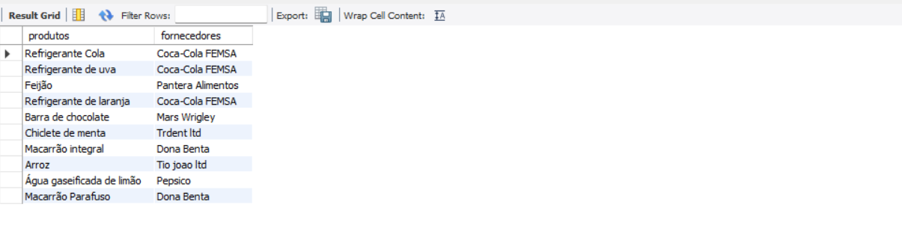

# View_sql

### Crie uma view que mostra todos os produtos e suas respectivas marcas

```sql
-- Este comando cria uma view chamada "Produtos_Marcas"
create view Produtos_Marcas as 
select
-- seleciona quais campos e de quais tabelas vou usar
	produtos.prd_nome as produto,  --  cria a coluna produto e atribui o prd_nome 
	marcas.mrc_nome as marca	--  cria a coluna marca e atribui mrc.marca
-- pega a tabela principal     
from produtos
-- Esta cláusula une as tabelas "produtos" e "marcas" usando a coluna "mrc_id" como chave estrangeira.
join marcas on marcas.mrc_id = produtos.prd_marca_id ;
```


### Crie uma view que mostra todos os produtos e seus respectivos fornecedores
```sql
-- Cria uma view chamada `Produtos_Fornecedores`
CREATE VIEW Produtos_Fornecedores AS

-- Especifica quais colunas serão retornadas pela consulta
SELECT
	produtos.prd_nome AS produtos,
	fornecedores.frn_nome AS fornecedores

-- Especifica que a consulta começará na tabela `produtos`
FROM produtos

-- Une as tabelas `produtos` e `produto_fornecedor`
JOIN produto_fornecedor ON produto_fornecedor.pf_prod_id = produtos.prd_id

-- Une as tabelas `produto_fornecedor` e `fornecedores`
JOIN fornecedores ON produto_fornecedor.pf_forn_id = fornecedores.frn_id;
```

### Crie uma view que mostra todos os produtos e seus respectivos fornecedores e marcas;

```sql
-- Cria uma view chamada `Produtos_Fornecedores_marcas`
CREATE VIEW Produtos_Fornecedores_marcas AS

-- Especifica quais colunas serão retornadas pela consulta
SELECT
	produtos.prd_nome AS produtos,
	fornecedores.frn_nome AS fornecedores,
	marcas.mrc_nome AS marca

-- Especifica que a consulta começará na tabela `produtos`
FROM produtos

-- Une as tabelas `produtos` e `produto_fornecedor`
JOIN produto_fornecedor ON produto_fornecedor.pf_prod_id = produtos.prd_id

-- Une as tabelas `produto_fornecedor` e `fornecedores`
JOIN fornecedores ON produto_fornecedor.pf_forn_id = fornecedores.frn_id

-- Une as tabelas `produtos` e `marcas`
JOIN marcas ON marcas.mrc_id = produtos.prd_marca_id;

```

###
