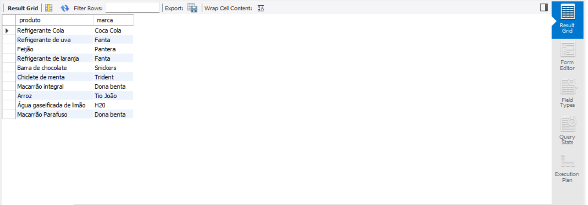

# View_sql

### Crie uma view que mostra todos os produtos e suas respectivas marcas

```sql
-- Este comando cria uma view chamada "Produtos_Marcas"
create view Produtos_Marcas as 
select
-- seleciona quais campos e de quais tabelas vou usar
	produtos.prd_nome as produto,  --  cria a coluna produto e atribui o prd_nome 
	marcas.mrc_nome as marca	--  cria a coluna marca e atribui mrc.marca
-- pega a tabela principal     
from produtos
-- Esta cláusula une as tabelas "produtos" e "marcas" usando a coluna "mrc_id" como chave estrangeira.
join marcas on marcas.mrc_id = produtos.prd_marca_id ;
```

